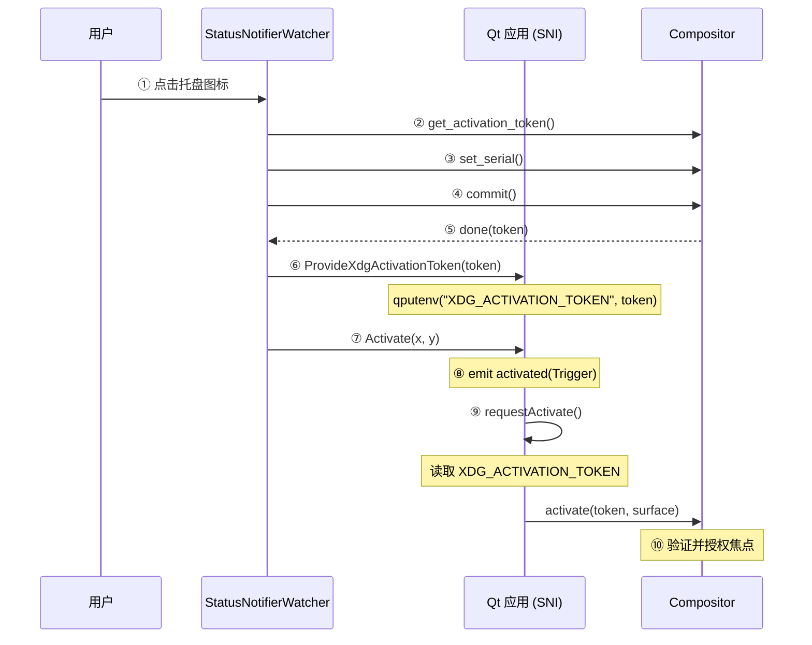

+++
title = "Wayland 窗口激活机制"
date = "2026-08-28"
description = "解析 xdg-activation-v1 协议下 token 的申请、传递与使用全流程，覆盖 GLib、Qt6、KDE kio 等实现。"
tags = [
    "Wayland",
    "Qt",
    "Linux",
    "AI-polished"
]
noToc = true
+++

Wayland 下，客户端无法像 X11 那样直接操作窗口焦点。所有窗口激活请求都必须经过 **xdg-activation-v1** 协议：申请者（通常是发起激活的一方）先从 compositor 获得 token，再将 token 交给目标应用，目标应用凭 token 向 compositor 请求焦点。

整个流程分为三个阶段：

```mermaid
sequenceDiagram
    participant App as 申请者
    participant Comp as Compositor
    participant Target as 目标进程

    rect rgb(60, 60, 90)
        Note over App,Comp: ① Token 申请
        App->>Comp: get_activation_token()
        App->>Comp: set_serial()
        App->>Comp: set_surface()
        App->>Comp: set_app_id()
        App->>Comp: commit()
        Comp-->>App: done(token)
    end

    rect rgb(90, 60, 60)
        Note over App,Target: ② Token 传递
        App->>Target: 环境变量 / D-Bus / socket
    end

    rect rgb(60, 90, 60)
        Note over Target,Comp: ③ Token 使用
        Target->>Comp: activate(token, surface)
        Note over Comp: 验证并授权焦点
    end
```



- **Token 申请**：谁想激活别人，谁负责向 compositor 申请 token（协议层面）
- **Token 传递**：通过环境变量、D-Bus、单例 socket 等方式将 token 从申请者交给目标进程（跨进程传递）
- **Token 使用**：目标进程将 token 提交给 compositor，获得焦点（协议层面）

本文重点分析第 2 部分（传递），基于 Qt6（qtbase）、GLib 和 KDE kio 源码。

<!--more-->

## 1. Token 申请

申请者（launcher、托盘宿主等）通过 `xdg_activation_v1` 全局接口创建 token 对象，设置关联信息后 commit，收到 compositor 返回的 token 字符串。

### 1.1 协议接口

`xdg_activation_v1` 是 compositor 提供的全局单例。客户端通过它申请 token 对象：

```xml
<!-- xdg-activation-v1.xml -->
<request name="get_activation_token">
    <description summary="requests a token">
        Creates an xdg_activation_token_v1 object that will provide
        the initiating client with a unique token for this activation.
    </description>
    <arg name="id" type="new_id" interface="xdg_activation_token_v1"/>
</request>
```

### 1.2 Token 对象生命周期

`xdg_activation_token_v1` 对象创建后，客户端依次调用以下请求（均为可选，但 `set_serial` 对安全性至关重要），最后 `commit()` 触发 compositor 签发 token：

| 请求 | 作用 | 必要性 |
| --- | --- | --- |
| `set_serial(serial, seat)` | 附加触发激活的用户输入事件（如鼠标点击的 serial），compositor 据此判断激活请求是否合法 | 强烈建议，影响 compositor 是否授权 |
| `set_app_id(app_id)` | 告知 compositor 目标应用 ID，用于显示启动提示等 | 可选 |
| `set_surface(surface)` | 设置申请者的 Wayland surface，部分 compositor 要求此字段 | 强烈建议 |
| `commit()` | 触发 compositor 签发 token | 必需 |
| `done(token)` | compositor 返回的异步事件，携带 token 字符串 | — |

### 1.3 Token 的有效性：一定能拿到，但不一定能激活

`commit()` **必定**返回一个 token 字符串（通过 `done` 事件），但这个 token 的权限级别不确定：

- **完整激活权限**：申请者调用了 `set_serial`（关联最近的用户输入事件）、`set_surface`（申请者 surface 有焦点）、且 compositor 认可该请求 → token 可以直接激活目标窗口
- **降级为 attention**：缺少 `set_serial`、`set_surface`，或申请时申请者 surface 没有焦点 → compositor 签发 token，但该 token 只能触发"引起注意"行为（如任务栏图标跳动），无法授予键盘焦点
- **过期失效**：部分 compositor 在 token 签发后长时间未使用会过期失效

> **反过来，attention 可以被有意利用**：客户端如果只需要"引起注意"而非获取焦点（如后台通知提醒用户查看），可以**故意不调用 `set_serial` 和 `set_surface`**，让 compositor 自动降级为 attention 行为。

需要注意，客户端调用之前并没有办法区分 token 是否有效。

### 1.4 Qt 中的封装

Qt Wayland 平台插件通过 `QWaylandXdgActivationTokenV1` 类封装上述流程（`qwaylandxdgactivationv1.cpp`）。具体使用方式参见[第 2 节（Token 传递）](#2-token-传递)中各场景的实际调用。

## 2. Token 传递

> **文档重点**：token 申请后，必须通过某种机制交给目标进程。由于 Wayland 的 IPC 隔离，不同场景采用了不同的传递手段。

### 2.1 通过环境变量传递（spawn 子进程）

适用于普通桌面应用（非 D-Bus activatable）。GLib 的 `GDesktopAppInfo` 在启动子进程时，将 token 注入 `XDG_ACTIVATION_TOKEN` 环境变量：

```c
// glib/gio/gdesktopappinfo.c
if (info->startup_notify) {
    sn_id = g_app_launch_context_get_startup_notify_id(launch_context,
                                                       G_APP_INFO(info), launched_files);
    if (sn_id) {
        envp = g_environ_setenv(envp, "DESKTOP_STARTUP_ID", sn_id, TRUE);
        envp = g_environ_setenv(envp, "XDG_ACTIVATION_TOKEN", sn_id, TRUE);
    }
}
```

目标应用读取 `XDG_ACTIVATION_TOKEN` 环境变量即可获得 token。协议规范要求目标应用**消费后立即 unset**，防止 token 泄露给进一步的子进程。

### 2.2 通过 D-Bus 传递（D-Bus activatable 应用）

适用于 Flatpak/snap 或注册了 D-Bus activatable 的应用。GLib 通过 `org.freedesktop.Application` 接口启动目标，将 token 随 D-Bus 调用一起发送：

```c
// glib/gio/gdesktopappinfo.c
sn_id = g_app_launch_context_get_startup_notify_id(launch_context,
                                                   G_APP_INFO(info), launched_files);
if (sn_id) {
    g_variant_builder_add(&builder, "{sv}", "desktop-startup-id",
                           g_variant_new_string(sn_id));
    g_variant_builder_add(&builder, "{sv}", "activation-token",
                           g_variant_new_take_string(g_steal_pointer(&sn_id)));
}
// 通过 org.freedesktop.Application.Open/Activate D-Bus 方法传递
g_dbus_connection_call(session_bus, info->app_id, object_path,
                       "org.freedesktop.Application",
                       uris ? "Open" : "Activate",
                       g_variant_builder_end(&builder), ...);
```

目标应用实现 `org.freedesktop.Application` 接口，从 `platform_data` 字典中读取 `desktop-startup-id` 和 `activation-token` 字段。

### 2.3 通过 SNI D-Bus 接口传递（系统托盘）

系统托盘（StatusNotifierItem）场景下，StatusNotifierWatcher 担任中间人：先向 compositor 申请 token，再通过 D-Bus 转发给 Qt 应用。

#### 2.3.1 Qt 应用注册托盘图标

Qt 应用向 StatusNotifierWatcher 注册托盘图标，建立 D-Bus 连接：

```cpp
// src/gui/platform/unix/dbusmenu/qdbusmenuconnection.cpp
bool QDBusMenuConnection::registerTrayIconWithWatcher(QDBusTrayIcon *item)
{
    QDBusMessage registerMethod = QDBusMessage::createMethodCall(
        StatusNotifierWatcherService, StatusNotifierWatcherPath,
        StatusNotifierWatcherService, "RegisterStatusNotifierItem"_L1);
    registerMethod.setArguments(QVariantList() << m_connection.baseService());
    return m_connection.callWithCallback(registerMethod, this,
           SIGNAL(trayIconRegistered()), SLOT(dbusError(QDBusError)));
}
```

#### 2.3.2 StatusNotifierWatcher 申请 token 并转发

用户点击托盘图标后，StatusNotifierWatcher 执行以下步骤（对应时序图中的 ②–⑥）：

1. 调用 `xdg_activation_v1.get_activation_token()`
2. 调用 `set_serial()` 关联鼠标点击事件
3. 调用 `commit()`
4. 接收 `done(token)` 事件
5. 调用 Qt 应用的 `ProvideXdgActivationToken(token)` D-Bus 方法，将 token 存入环境变量

```cpp
// src/gui/platform/unix/dbustray/qstatusnotifieritemadaptor.cpp
void QStatusNotifierItemAdaptor::ProvideXdgActivationToken(const QString &token)
{
    qCDebug(qLcTray) << token;
    qputenv("XDG_ACTIVATION_TOKEN", token.toUtf8());
}
```

> `ProvideXdgActivationToken` 不在原始 KDE StatusNotifierItem 规范中，是为 Wayland xdg-activation 补充的扩展接口。

#### 2.3.3 StatusNotifierWatcher 触发激活

紧接着调用 `Activate(x, y)` D-Bus 方法，触发 Qt 的 `activated(Trigger)` 信号：

```cpp
// src/gui/platform/unix/dbustray/qstatusnotifieritemadaptor.cpp
void QStatusNotifierItemAdaptor::Activate(int x, int y)
{
    qCDebug(qLcTray) << x << y;
    emit m_trayIcon->activated(QPlatformSystemTrayIcon::Trigger);
}
```

两个 D-Bus 方法的调用顺序至关重要：token 必须先写入环境变量，`Activate` 信号到达后应用才能读到。

#### 2.3.4 完整时序



### 2.4 单例应用的 token 转发

单例应用检测到已有实例运行时，新进程需要将 token 转发给已有实例，否则已有实例的窗口无法获得焦点。

以 Telegram 为例，新实例将 `XDG_ACTIVATION_TOKEN` 做 Base64 编码后，通过本地 socket 发送给已有实例：

```cpp
void Sandbox::socketConnected() {
    _secondInstance = true;
    QString commands;
    if (qEnvironmentVariableIsSet("XDG_ACTIVATION_TOKEN")) {
        commands += u"XDG_ACTIVATION_TOKEN:"_q
                 + qgetenv("XDG_ACTIVATION_TOKEN").toBase64() + ';';
    }
    // ... 其他命令
    _localSocket.write(commands.toLatin1());
}
```

已有实例解码后调用 `requestActivate()` 将 token 提交给 compositor，从而获得焦点。

### 2.5 KDE kio 启动器

KDE 的 `kio` 框架在启动应用时负责处理 token。`KProcessRunner` 根据是否有现成 token 选择不同路径：

```cpp
// kio/src/gui/kprocessrunner.cpp
#if HAVE_WAYLAND
    if (KWindowSystem::isPlatformWayland()) {
        if (!asn.isEmpty()) {
            // 调用方已提供 token，直接设入子进程环境变量
            m_process->setEnv(QStringLiteral("XDG_ACTIVATION_TOKEN"),
                               QString::fromUtf8(asn));
        } else {
            // 无现成 token，从焦点窗口异步请求
            auto window = qGuiApp->focusWindow();
            if (!window && !qGuiApp->allWindows().isEmpty()) {
                window = qGuiApp->allWindows().constFirst();
            }
            if (window) {
                m_waitingForXdgToken = true;
                m_xdgActivationTokenFuture = KWaylandExtras::xdgActivationToken(
                    window, resolveServiceAlias());
                m_xdgActivationTokenFuture.then(this, [this](const QString &token) {
                    m_process->setEnv(QStringLiteral("XDG_ACTIVATION_TOKEN"), token);
                    m_waitingForXdgToken = false;
                    startProcess();
                });
                return;  // 等 token 到达后再启动进程
            }
        }
    }
#endif
```

关键策略：**等 token 到达后再启动进程**，确保子进程从第一刻起环境变量中就有有效的 token。相比"先启动再设环境变量"更可靠。

### 2.6 非 GUI 环境启动

`xdg-open` 和普通终端启动应用时，没有 GUI 焦点上下文，无法获取有效的 activation token。在 KDE 下，目标窗口会降级为任务栏图标闪烁。

KDE Konsole 启动 Kate（单例应用）做了非标准特判：Konsole 为子进程提供 `KONSOLE_DBUS_ACTIVATION_COOKIE`，子进程可通过 KDE 私有 D-Bus 接口获取激活 token。

> 参考：[Improving Wayland Window Activation for Kate & Konsole](https://cullmann.dev/posts/improving-wayland-window-activation-for-kate-konsole/)

### 2.7 传递路径汇总

| 场景 | 发起方 | 传递方式 | 目标进程获取 token 的途径 |
| --- | --- | --- | --- |
| 普通桌面应用启动 | GLib/GDesktopAppInfo | 环境变量 `XDG_ACTIVATION_TOKEN` | 读取进程环境变量 |
| D-Bus activatable 应用启动 | GLib/GDesktopAppInfo | D-Bus `platform_data` 字段 | 实现 `org.freedesktop.Application` 接口 |
| 系统托盘点击 | StatusNotifierWatcher | D-Bus `ProvideXdgActivationToken` | 读取 `XDG_ACTIVATION_TOKEN` 环境变量 |
| 单例应用转发 | 新实例 | 本地 socket | 解码后调用 `requestActivate()` |
| KDE 启动器启动 | KIO/KProcessRunner | 环境变量（延迟写入） | 读取进程环境变量 |

## 3. Token 使用

> **协议为主，Qt 辅助说明**

目标应用获取 token 后，通过 `xdg_activation_v1.activate()` 将 token 提交给 compositor，请求激活指定 surface。

### 3.1 协议接口

```xml
<!-- xdg-activation-v1.xml -->
<request name="activate">
    <description summary="notify new interaction being available">
        Requests surface activation. It's up to the compositor to display
        this information as desired, for example by placing the surface above
        the rest.

        The compositor may know who requested this by checking the activation
        token and might decide not to follow through with the activation if it's
        considered unwanted.

        Compositors can ignore unknown activation tokens when an invalid
        token is passed.
    </description>
    <arg name="token" type="string" summary="the activation token of the initiating client"/>
    <arg name="surface" type="object" interface="wl_surface"
         summary="the wl_surface to activate"/>
</request>
```

Compositor 收到请求后：

1. **验证 token**：token 必须是 compositor 自身签发的，且未过期
2. **决策是否授权**：compositor 有权拒绝，例如检测到焦点窃取企图
3. **授予焦点**：验证通过后，向目标 surface 发送 `wl_keyboard.enter` 事件
4. **一次性消费**：同一 token 重复提交时，compositor 返回 `already_used` error

### 3.2 Qt 中的实现

Qt Wayland 平台插件在 `QWaylandXdgSurface::requestActivate()` 中按优先级尝试三个 token 来源：

```cpp
// src/plugins/platforms/wayland/plugins/shellintegration/xdg-shell/qwaylandxdgshell.cpp
bool QWaylandXdgSurface::requestActivate()
{
    if (auto *activation = m_shell->activation()) {
        // 优先级 1（最高）：预设 token，通过 setXdgActivationToken() 提前设置
        if (!m_activationToken.isEmpty()) {
            activation->activate(m_activationToken, window()->wlSurface());
            m_activationToken = {};
            return true;
        }
        // 优先级 2：环境变量（托盘激活的主要路径）
        else if (const auto token = qEnvironmentVariable("XDG_ACTIVATION_TOKEN");
                 !token.isEmpty()) {
            activation->activate(token, window()->wlSurface());
            qunsetenv("XDG_ACTIVATION_TOKEN");  // 一次性消费，防止泄露给子进程
            return true;
        }
        // 优先级 3：实时请求（需要用户输入事件关联）
        else {
            const auto tokenProvider = activation->requestXdgActivationToken(
                wlWindow->display(), wlWindow->wlSurface(), serial, appId);
            connect(tokenProvider, &QWaylandXdgActivationTokenV1::done, this,
                    [this](const QString &token) {
                        m_shell->activation()->activate(token, window()->wlSurface());
                    });
            return true;
        }
    }
    return false;
}
```

### 3.3 Token 优先级与来源

| 优先级 | 来源 | 存储位置 | 典型场景 |
| --- | --- | --- | --- |
| 最高 | 预设 token | `m_activationToken` 成员变量 | 通过 `setXdgActivationToken()` 提前设置 |
| 中 | 环境变量 | `XDG_ACTIVATION_TOKEN` | 托盘激活、D-Bus/SNI 传递 |
| 最低 | 实时请求 | 异步回调 | 无 token 时的兜底路径 |

### 3.4 窗口自动激活

窗口首次显示时，Qt 会自动调用 `requestActivateOnShow()`。以下窗口类型**不会**自动激活：

- `Qt::ToolTip`、`Qt::Popup`、`Qt::SplashScreen`
- 设置了 `Qt::WindowDoesNotAcceptFocus` 标志的窗口
- 设置了 `_q_showWithoutActivating` 属性的窗口

### 3.5 Qt 内部调用链

```
QWindow::requestActivate()
    │
    ▼
QPlatformWindow::requestActivateWindow()
    │
    ▼
QWaylandWindow::requestActivateWindow()     [qwaylandwindow.cpp]
    │
    ▼
QWaylandXdgSurface::requestActivate()       [qwaylandxdgshell.cpp]
    │
    ▼
activation->activate(token, surface)       [xdg-activation-v1 协议]
    │
    ▼
Compositor 验证 token，决定是否授权焦点
```

### 3.6 失败情况与降级行为

Compositor 对 `activate()` 的响应不是简单的"成功/失败"，而是存在梯度：

| 场景 | 原因 | Compositor 行为 |
| --- | --- | --- |
| Token 有完整权限 | 申请时提供了有效的 serial + surface，且未过期 | 授予键盘焦点（`wl_keyboard.enter`） |
| Token 权限不足（降级） | 缺少 `set_serial`/`set_surface`，或申请时 surface 无焦点 | 仅触发"引起注意"行为（任务栏图标跳动），不授予键盘焦点 |
| Token 过期 | 签发后长时间未使用 | 静默忽略，焦点不变 |
| Token 已使用 | 同一 token 被重复提交 | compositor 返回 `already_used` error |
| Token 无效 | 传入非 compositor 签发的字符串 | compositor 忽略 |
| 无 token | 环境变量未设置且无预设 token | 尝试实时请求，但可能因无输入事件被降级为 attention |
| 协议不可用 | compositor 不支持 xdg-activation-v1 | `m_shell->activation()` 返回 `nullptr`，`requestActivate()` 返回 `false` |

> 客户端在所有情况下都无法预先得知 token 的权限级别，只能提交后由 compositor 决定。

## 附录：与 X11 的对比

| 特性 | X11 | Wayland |
| --- | --- | --- |
| 焦点操作 | 客户端可直接调用 `XRaiseWindow()` 或发送 `_NET_ACTIVE_WINDOW` | 必须通过 compositor 授权的 token 机制 |
| 安全模型 | 客户端自行决定焦点归属 | 客户端请求 → compositor 决定 → compositor 通知 |
| 焦点窃取防护 | 依赖 compositor（WM）的实现 | 协议层面强制要求 |
| 托盘激活 | SNI 的 `Activate` 可直接操作窗口 | 必须通过 `xdg-activation-v1` 协议 |

## 参考资料

- [xdg-activation-v1 协议规范（英文）](https://wayland.app/protocols/xdg-activation-v1)
- [xdg-activation-v1 协议详解（中文）](https://dwapp.github.io/wayland-explorer-cn/xdg-activation-v1)
- [KDE StatusNotifierItem 规范](https://www.freedesktop.org/wiki/Specifications/StatusNotifierItem/)
- Qt6 源码：`src/gui/platform/unix/dbustray/`、`src/plugins/platforms/wayland/`
- GLib 源码：`glib/gio/gdesktopappinfo.c`
